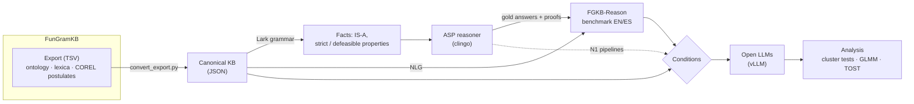
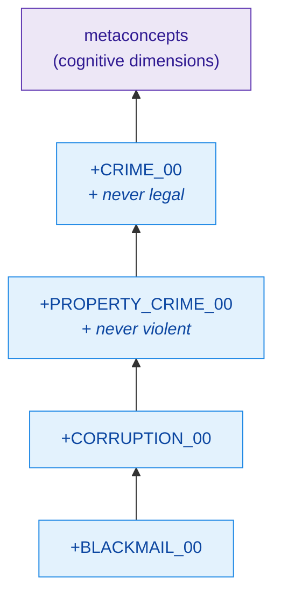
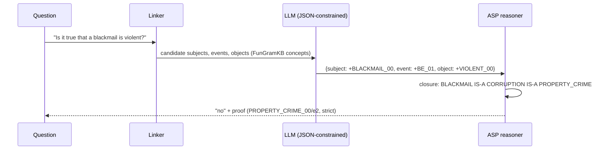
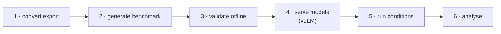

# fgkb-llm — deep conceptual semantics from FunGramKB for open LLMs

[](LICENSE)
[](LICENSE-DATA)
[](https://doi.org/10.5281/zenodo.23271854)


-purple.svg)

Can a linguistically grounded knowledge base make small open LLMs reason better about word meaning — and is the
gain **reasoning with the knowledge** rather than recall? This repository holds the code, benchmark generator and
analysis of paper 1 of the FunGramKB × LLM project (manuscript under review).

**Headline results (main study, 1 484 test items, 3 model families):**

| | Qwen2.5-7B | Llama-3.1-8B | OLMo-3-7B |
|---|:---:|:---:|:---:|
| No knowledge (B1) | 47.6 | 40.6 | 45.5 |
| FunGramKB graph context (G2) | **71.4** | **55.2** | **68.2** |
| Neuro-symbolic: LLM → COREL query → reasoner (N1P2) | **86.8** | **85.5** | **80.1** |

Accuracy (%) on the deep-reasoning contrast subset. G2 beats no knowledge, the bare taxonomy, WordNet and
corrupted postulates in all three models; the neuro-symbolic route adds 13–31 points more, with a checkable proof
for every answer.

---

## How it works



* **Gold answers never come from an LLM.** Every item is answered by an answer-set-programming reasoner over the
  knowledge base, which also returns the proof (IS-A chain + postulate used).
* **Bilingual twins.** Each item exists in English and Spanish; twins share a cluster id and are analysed together.
* **Shortcut-proof.** Labels are balanced per queried property, so a classifier that sees only the question stays
  at or below the majority baseline; pseudoword concepts test reasoning on knowledge no model can have memorised.

### The ontology the benchmark is built on



FunGramKB has three levels: **metaconcepts** (`#`, the upper level, derived from DOLCE, SUMO, WordNet, SIMPLE,
the Generalized Upper Model and Mikrokosmos), **basic concepts** (`+`, the defining vocabulary of meaning
postulates) and **terminal concepts** (`$`). Meaning postulates are written in COREL, e.g.

```
+(e1: +BE_00 (x1: +PROPERTY_CRIME_00)Theme (x2: +CRIME_00)Referent)
+(e2: n +BE_01 (x1)Theme (x3: +VIOLENT_00)Attribute)
*(e3: +OBTAIN_00 (x4: +HUMAN_00)Theme (x5)Referent (f1: x1)Result)
```

`+` is strict, `*` defeasible (inherited unless a more specific concept says otherwise). *Is blackmail violent?*
needs three inference steps: blackmail → corruption → property crime, which is strictly never violent.

### Conditions compared

| Code | What the model receives | Question it answers |
|---|---|---|
| **B1** | the question only | baseline |
| **G1** | IS-A chains of the concepts | is the taxonomy enough? |
| **G2** | FunGramKB subgraph: chains + verbalised postulates | does deep semantics help? (H1) |
| **G3** | WordNet knowledge on the same concepts | is any lexical knowledge enough? (H2) |
| **G4** | postulates moved to the wrong concepts | is it the content or the format? (H2) |
| **R1** | dense retrieval of the same verbalised postulates | is the graph structure needed? (H2) |
| **N1R / N1P2** | nothing: the LLM writes a COREL query, the reasoner answers | execute instead of prompt? (H3) |
| N1P3 | N1P2 + knowledge-based normalisation of the query | exploratory |

All knowledge conditions share the same 1 500-token budget; only the background block differs.

### The neuro-symbolic pipeline (N1P2)



The LLM only fills four slots; the reasoner decides, using an open-world rule (*undetermined* when the knowledge
base says nothing). Its weak point is translating free paraphrases, which N1P3 largely repairs.

---

## Repository layout

```
src/fgkb_llm/
  kb/          FunGramKB data model and canonical JSON loader
  corel/       COREL grammar (Lark), AST, fact extraction, verbalisation (EN/ES), GBNF
  reasoner/    ASP (clingo) reasoner: strict/defeasible inheritance, exceptions, proofs = gold source
  graph/       budgeted linearisation of the knowledge subgraph (G1/G2/G4 contexts)
  linking/     text → concept linking with sense disambiguation
  retrieval/   dense (multilingual-e5) and TF-IDF retrieval over verbalised postulates (R1)
  controls/    G3 WordNet knowledge, G4 corrupted knowledge base
  bench/       FGKB-Reason generator, concept splits, contrast subset, wordings W2/W3
  conditions/  prompt builder and ablation switches
  pipeline/    neuro-symbolic pipelines N1R / N1P2 / N1P3
  llm/         backends: mock, OpenAI-compatible (vLLM server), vLLM offline, transformers
  eval/, analysis/   parsing, metrics, bootstrap, McNemar, Holm, kappa, LaTeX tables
configs/       experiment configs (main_*.yaml = preregistered main study)
scripts/       conversion, benchmark, run and analysis scripts (catalogue: docs/CATALOGO_SCRIPTS.md)
docs/          analysis plan + amendments, reports, expert-review sheets, data format
tests/         pytest suite on an illustrative toy knowledge base
```

## Quick start (no GPU, toy knowledge base)

```bash
pip install -e ".[dev,analysis]"
python tests/fixtures/make_toy_kb.py
pytest -q
fgkb check-kb --kb tests/fixtures/toy_kb.json
fgkb bench    --kb tests/fixtures/toy_kb.json --out results/toy_bench.jsonl
fgkb run      --config configs/dryrun.yaml        # mock backend: the numbers are meaningless
```

The toy knowledge base is illustrative only; never report results on it.

## Reproducing the main study



```bash
# 1. FunGramKB export (not distributed here) in data/raw/  ->  canonical knowledge base
python scripts/convert_export.py --extension data/extension/core_extension.json \
    --extension data/extension/lexicon_stubs.json --out data/processed/fungramkb.json
# 2-3. benchmark (fixed hash seed) and offline validation (gold re-derivation, artefact tests, power)
python scripts/make_main_bench.py --kb data/processed/fungramkb.json --out data/processed/fgkb_reason_main.jsonl
python scripts/validate_offline.py --bench data/processed/fgkb_reason_main.jsonl \
    --kb data/processed/fungramkb.json --out results/validation_main.json --report docs/validation_report.md
# 4. models on a GPU server (DGX Spark in the paper): scripts/spark_main_up.sh
# 5-6. runs + preregistered analysis (Windows client; resumable)
powershell -ExecutionPolicy Bypass -File scripts\run_main_windows.ps1
```

Each run writes a manifest with the SHA-256 of the knowledge base, benchmark, configuration and code. The analysis
plan was frozen at git tag `prereg-v1` (`docs/analysis_plan.md`); later changes are listed in
`docs/analysis_plan_amendments.md`. The main study ran at tag `main-run-v1`.

| Analysis | Script |
|---|---|
| H1–H3, sensitivity S1/S2/S5, diagnostics | `scripts/main_analysis.py` |
| Mixed-effects models (lme4) | `scripts/main_glmm.R` |
| Robustness to wording (W1/W2/W3) | `scripts/wording_analysis.py` |
| Ablations S3/S4 | `scripts/ablation_analysis.py` |
| Expert reviews and NLG audit | `scripts/make_review_sheet.py`, `scripts/make_nlg_audit_sheet.py`, `scripts/nlg_sensitivity.py` |
| Contamination check (OLMo training data) | `scripts/contamination_check.py` |
| Paper tables | `scripts/paper_tables.py` |

## Benchmark versions

* **v1.0** — the benchmark evaluated in the paper (its file, identified by its SHA-256, is the reference).
* **v1.1** — corrected verbalisation (COREL indefinite `i`, light-verb collocations, preferred lemmas):
  `convert_export.py --lexicon-fixes data/extension/lexicon_fixes_v1_1.json`, then `make_main_bench.py`.

## Data availability

The FunGramKB export is **not** included (`data/raw/` and `data/processed/` are git-ignored); it can be requested
from the FunGramKB project at <https://fungramkb.ucam.edu>. Concepts authored for this study are in `data/extension/`.

## Citation

The paper is under review; this section will point to it once it is published. Until then, please cite the
software archive, [doi:10.5281/zenodo.23271854](https://doi.org/10.5281/zenodo.23271854) — GitHub's *Cite this
repository* button gives the full reference from `CITATION.cff`.

## Licence

* **Code:** [Apache-2.0](LICENSE).
* **Data** (`docs/`, `data/extension/`, released benchmark files): [CC BY 4.0](LICENSE-DATA).
* The FunGramKB export itself is not included and is not covered by these licences.
